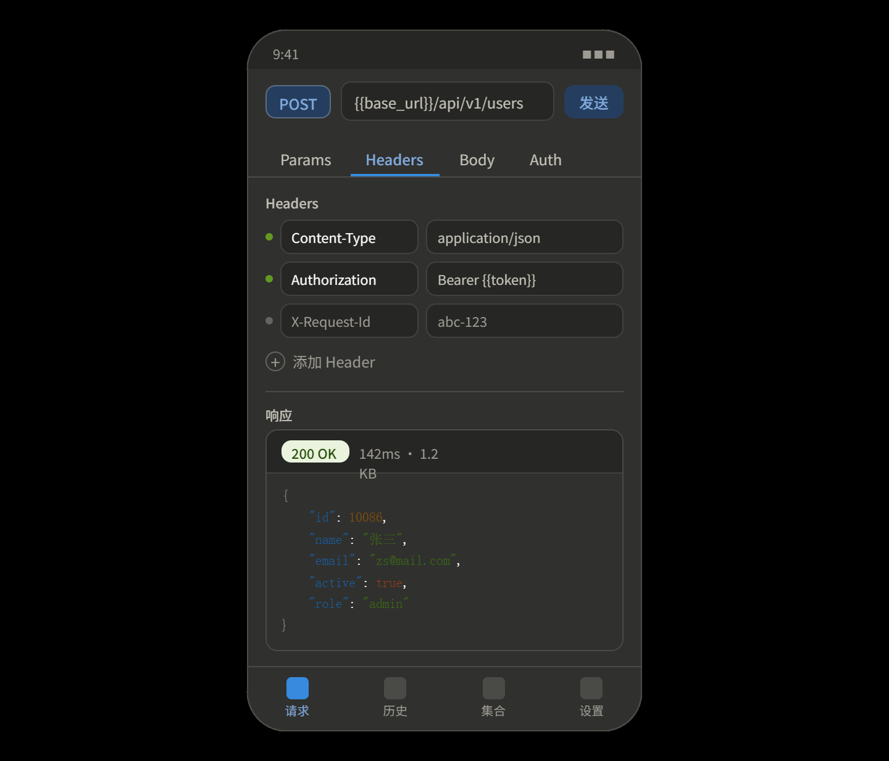
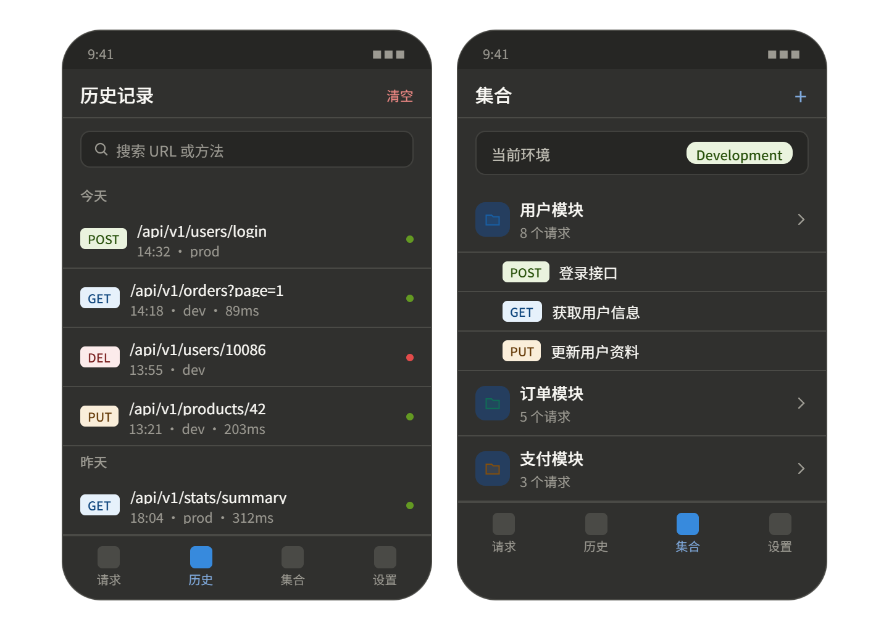
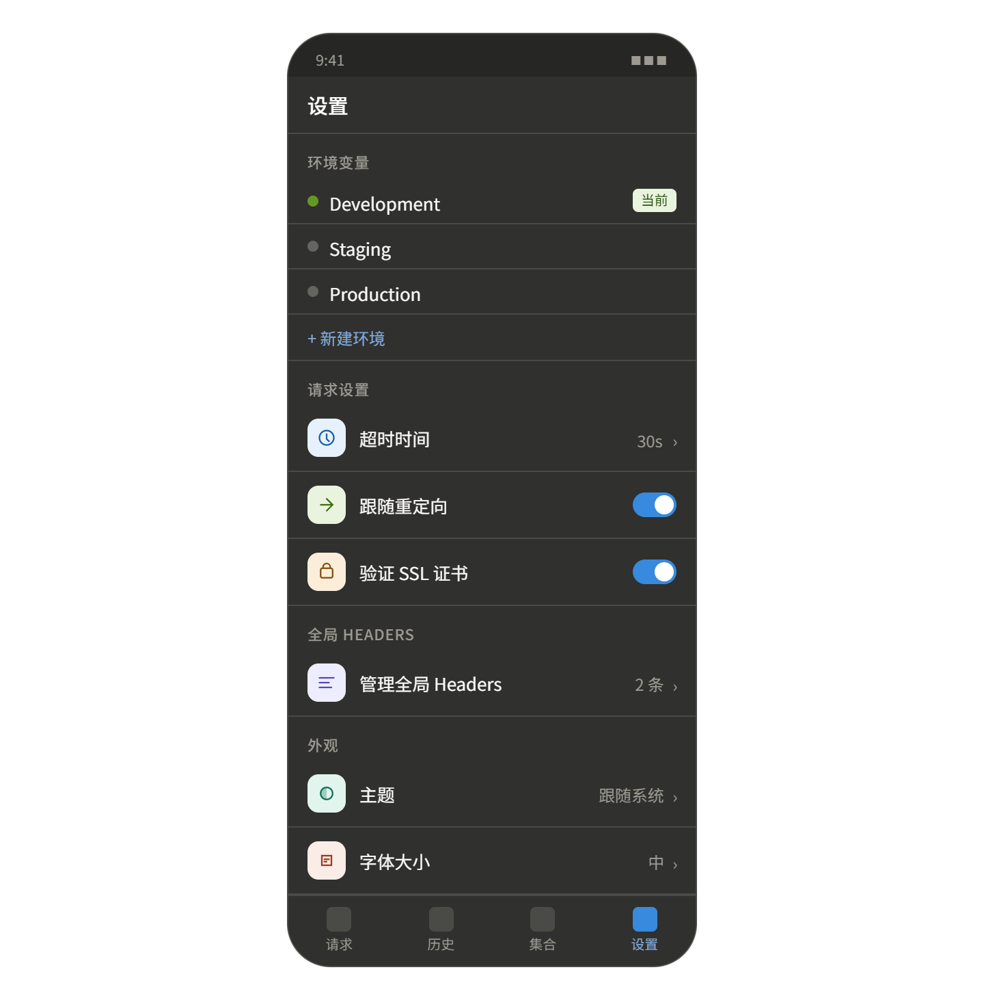

# HarmonyRequest

> 鸿蒙原生 HTTP 接口调试工具 —— 移动端的 Postman，专为 HarmonyOS NEXT 设计


---

## 简介

HarmonyRequest 是一款运行在 HarmonyOS NEXT 上的 HTTP
接口调试工具。支持多种请求方式、参数配置、响应高亮展示、历史记录、请求集合管理，以及鸿蒙独有的多设备同步能力。目标是让后端开发者和鸿蒙开发者在手机和平板上也能流畅地完成接口调试工作。

---

## 功能说明

### 核心请求功能

- 支持 GET / POST / PUT / DELETE / PATCH / HEAD / OPTIONS 请求方法
- URL 输入支持环境变量占位符替换（如 `{{base_url}}/api/user`）
- Query 参数可视化编辑，支持单条启用/禁用
- 自定义 Headers，内置常用 Header 快速添加（Content-Type、Authorization 等）
- Body 支持多种格式：
    - `raw JSON`（带语法校验）
    - `form-data`
    - `x-www-form-urlencoded`
    - `plain text`
- 认证方式：Bearer Token / Basic Auth / API Key

### 响应展示

- JSON 响应自动格式化 + 语法高亮（key/string/number/boolean 分色显示）
- 响应状态码颜色标注（2xx 绿色 / 3xx 蓝色 / 4xx 橙色 / 5xx 红色）
- 显示响应耗时、数据大小、响应 Headers
- 支持一键复制响应体
- 响应体支持折叠/展开节点（JSON Tree 视图）

### 历史记录

- 每次请求自动保存到本地数据库
- 按时间分组展示，支持搜索
- 点击历史条目一键恢复完整请求配置
- 支持删除单条或清空全部历史

### 请求集合

- 按项目创建集合文件夹
- 将请求保存到指定集合
- 集合支持导入 / 导出（JSON 格式）
- 支持从 Postman Collection v2.1 格式导入

### 环境变量

- 创建多套环境（Development / Staging / Production）
- 一键切换当前激活环境
- 变量在 URL / Headers / Body 中自动替换
- 全局变量（所有环境共享）

### 鸿蒙特有能力

- **多设备同步**：使用分布式 KV 存储，手机和平板的集合、环境变量实时同步
- **元服务形态**：常用请求可固定到负一屏，一键快速发送
- **平板适配**：横屏双栏布局，左侧集合列表 + 右侧请求编辑区

---

## 架构图

```
┌─────────────────────────────────────────────────────────────┐
│                        UI Layer (ArkTS)                      │
│                                                             │
│   ┌──────────┐  ┌──────────┐  ┌──────────┐  ┌──────────┐  │
│   │ 请求页面  │  │ 历史页面  │  │ 集合页面  │  │ 设置页面  │  │
│   └────┬─────┘  └────┬─────┘  └────┬─────┘  └────┬─────┘  │
│        └─────────────┴──────────────┴──────────────┘        │
│                            │                                 │
├────────────────────────────┼────────────────────────────────┤
│                     ViewModel Layer                          │
│                                                             │
│   ┌──────────────┐  ┌──────────────┐  ┌─────────────────┐  │
│   │ RequestVM    │  │ HistoryVM    │  │ CollectionVM    │  │
│   │ - 请求状态   │  │ - 历史列表   │  │ - 集合管理      │  │
│   │ - 响应数据   │  │ - 搜索过滤   │  │ - 环境变量      │  │
│   └──────┬───────┘  └──────┬───────┘  └────────┬────────┘  │
│          └─────────────────┴───────────────────┘            │
│                            │                                 │
├────────────────────────────┼────────────────────────────────┤
│                      Service Layer                           │
│                                                             │
│   ┌──────────────┐  ┌──────────────┐  ┌─────────────────┐  │
│   │ HttpService  │  │ StorageService│  │ EnvService      │  │
│   │ 发送请求     │  │ 本地持久化    │  │ 变量替换        │  │
│   │ 解析响应     │  │ 历史存储      │  │ 环境切换        │  │
│   └──────┬───────┘  └──────┬───────┘  └────────┬────────┘  │
│          └─────────────────┴───────────────────┘            │
│                            │                                 │
├────────────────────────────┼────────────────────────────────┤
│                    HarmonyOS API Layer                        │
│                                                             │
│   @ohos.net.http    @ohos.data.relationalStore               │
│   @ohos.data.distributedKVStore    @ohos.pasteboard          │
└─────────────────────────────────────────────────────────────┘
```

---

## 项目目录

```
HarmonyRequest/
├── entry/
│   └── src/
│       └── main/
│           ├── module.json5                    # 权限声明、元服务配置
│           ├── ets/
│           │   ├── entryability/
│           │   │   └── EntryAbility.ets        # 应用入口
│           │   │
│           │   ├── pages/                      # 页面
│           │   │   ├── Index.ets               # 主页（Tab 导航）
│           │   │   ├── RequestPage.ets          # 请求页
│           │   │   ├── HistoryPage.ets          # 历史记录页
│           │   │   ├── CollectionPage.ets       # 集合管理页
│           │   │   └── SettingsPage.ets         # 设置页
│           │   │
│           │   ├── components/                 # 可复用组件
│           │   │   ├── request/
│           │   │   │   ├── MethodSelector.ets   # 请求方法选择器
│           │   │   │   ├── UrlInput.ets         # URL 输入栏
│           │   │   │   ├── ParamsEditor.ets     # 参数编辑器（Key-Value）
│           │   │   │   ├── HeadersEditor.ets    # Headers 编辑器
│           │   │   │   ├── BodyEditor.ets       # Body 编辑器
│           │   │   │   └── AuthEditor.ets       # 认证配置
│           │   │   ├── response/
│           │   │   │   ├── ResponsePanel.ets    # 响应面板
│           │   │   │   ├── JsonHighlight.ets    # JSON 高亮渲染
│           │   │   │   ├── StatusBadge.ets      # 状态码徽标
│           │   │   │   └── ResponseHeaders.ets  # 响应 Headers 展示
│           │   │   └── common/
│           │   │       ├── KeyValueRow.ets      # 通用 Key-Value 行
│           │   │       ├── EmptyState.ets       # 空状态占位图
│           │   │       └── LoadingOverlay.ets   # 加载遮罩
│           │   │
│           │   ├── viewmodel/                  # ViewModel 层
│           │   │   ├── RequestViewModel.ets     # 请求页状态管理
│           │   │   ├── HistoryViewModel.ets     # 历史记录状态管理
│           │   │   ├── CollectionViewModel.ets  # 集合状态管理
│           │   │   └── SettingsViewModel.ets    # 设置状态管理
│           │   │
│           │   ├── services/                   # 服务层
│           │   │   ├── HttpService.ets          # HTTP 请求封装
│           │   │   ├── StorageService.ets       # 本地数据库操作
│           │   │   ├── DistributedService.ets   # 分布式同步服务
│           │   │   └── EnvService.ets           # 环境变量替换服务
│           │   │
│           │   ├── model/                      # 数据模型
│           │   │   ├── HttpRequest.ets          # 请求模型
│           │   │   ├── HttpResponse.ets         # 响应模型
│           │   │   ├── Collection.ets           # 集合模型
│           │   │   ├── Environment.ets          # 环境变量模型
│           │   │   └── KeyValuePair.ets         # 键值对模型
│           │   │
│           │   └── utils/                      # 工具函数
│           │       ├── JsonFormatter.ets        # JSON 格式化
│           │       ├── UrlParser.ets            # URL 解析与变量替换
│           │       ├── SizeFormatter.ets        # 字节大小格式化
│           │       └── TimeFormatter.ets        # 时间格式化
│           │
│           └── resources/
│               ├── base/
│               │   ├── element/
│               │   │   ├── string.json          # 文案
│               │   │   └── color.json           # 颜色变量
│               │   └── media/                   # 图标资源
│               └── en_US/
│                   └── element/
│                       └── string.json          # 英文文案
│
├── README.md
├── CHANGELOG.md
└── build-profile.json5
```

---

## TODO List

### 阶段一：MVP（目标 4～6 周）

#### 基础框架

- [ ] 搭建 Tab 导航结构（请求 / 历史 / 集合 / 设置）
- [ ] 平板横屏双栏布局适配
- [ ] 全局主题色配置（深色 / 浅色模式）

#### 请求功能

- [ ] URL 输入栏 + 请求方法下拉选择
- [ ] Query 参数编辑（Key-Value 列表，支持启用/禁用）
- [ ] Headers 编辑（Key-Value 列表 + 常用 Header 快速添加）
- [ ] Body 编辑器：raw JSON 模式
- [ ] Body 编辑器：form-data 模式
- [ ] Body 编辑器：x-www-form-urlencoded 模式
- [ ] 发送请求（封装 `@ohos.net.http`）
- [ ] 请求 loading 状态展示
- [ ] 取消正在进行的请求

#### 响应展示

- [ ] 响应状态码 + 耗时 + 数据大小展示
- [ ] 响应 Body 纯文本展示
- [ ] JSON 响应自动格式化
- [ ] JSON 语法高亮（分色渲染）
- [ ] 响应 Headers 查看
- [ ] 一键复制响应体

#### 历史记录

- [ ] 请求完成后自动保存到本地数据库
- [ ] 历史列表按时间分组展示
- [ ] 点击历史条目恢复请求配置
- [ ] 删除单条历史
- [ ] 清空全部历史

#### 上架准备

- [ ] 隐私政策页面
- [ ] 应用图标设计
- [ ] 应用市场截图（手机 + 平板各 3 张）
- [ ] 应用描述文案（中英文）

---

### 阶段二：效率提升（上架后迭代）

- [ ] 环境变量管理（创建 / 编辑 / 切换环境）
- [ ] URL 和 Body 中的变量自动替换（`{{variable}}`）
- [ ] 全局 Headers 配置（每次请求自动携带）
- [ ] Bearer Token 认证支持
- [ ] Basic Auth 认证支持
- [ ] API Key 认证支持
- [ ] 请求集合创建与管理
- [ ] 将请求保存到集合
- [ ] 集合导出为 JSON 文件
- [ ] 从 Postman Collection v2.1 格式导入
- [ ] 历史记录搜索
- [ ] JSON 响应树形折叠 / 展开
- [ ] 响应图片预览

---

### 阶段三：鸿蒙差异化（长期规划）

- [ ] 分布式 KV 存储：集合和环境变量多设备同步
- [ ] 元服务形态：常用请求固定到负一屏
- [ ] 小艺意图接入："发送一个 GET 请求到 xxx"
- [ ] 请求耗时统计图表（按集合/时间维度）
- [ ] SSL 证书配置（双向认证）
- [ ] Cookie 管理
- [ ] 请求前置脚本 / 后置断言（轻量版）
- [ ] WebSocket 连接支持

---

## 权限声明

```json
{
  "requestPermissions": [
    {
      "name": "ohos.permission.INTERNET",
      "reason": "发送 HTTP 请求需要网络访问权限"
    },
    {
      "name": "ohos.permission.GET_NETWORK_INFO",
      "reason": "检测网络连接状态"
    }
  ]
}
```

---

## 开发环境

| 工具            | 版本      |
|---------------|---------|
| DevEco Studio | 5.0+    |
| HarmonyOS SDK | API 12+ |
| ArkTS         | 1.2+    |
| 目标设备          | 手机 / 平板 |

---

## License

MIT License © 2025




